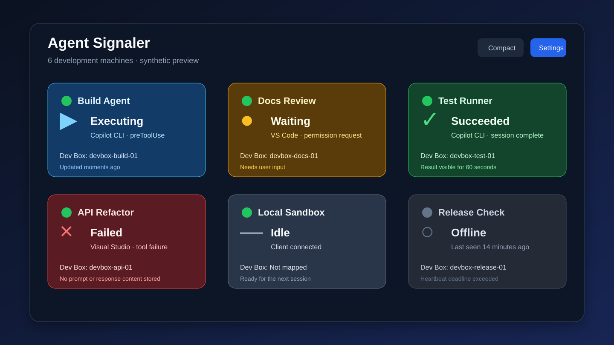
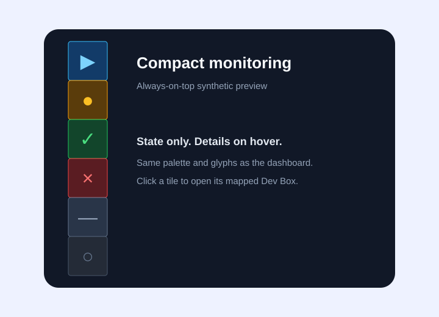
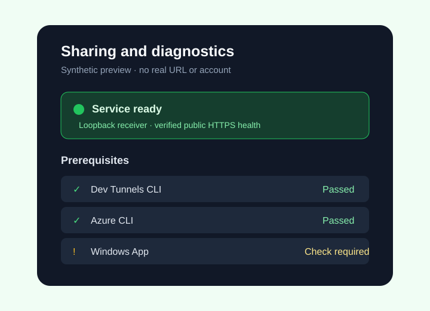
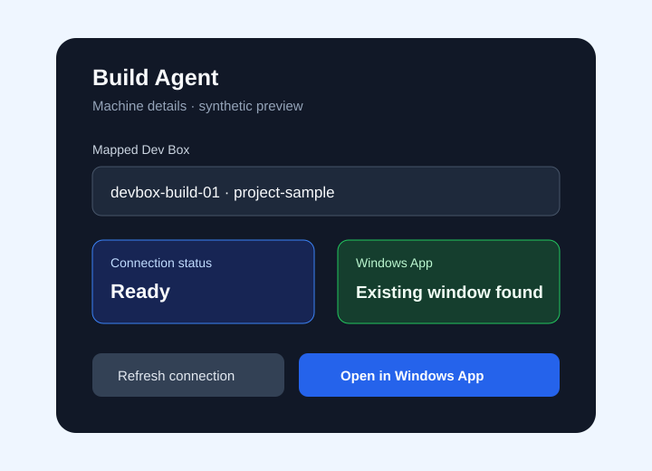
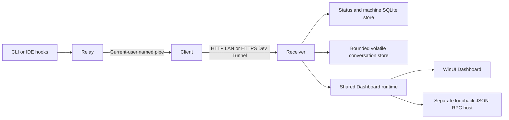

# Agent Signaler

**See which Copilot sessions are working, waiting for you, or finished across your Windows development machines.**

Agent Signaler combines a WinUI dashboard, a persistent reporting Client, and
user-level hooks for Copilot CLI and candidate Visual Studio/VS Code integrations.
Use full-size computer cards or compact always-on-top tiles. Developers building
their own local clients can use the standalone WebSocket JSON-RPC host instead.

> [!IMPORTANT]
> This is an early Windows-only project, not a production-certified monitoring
> service. Releases may be unsigned, and live IDE, cloud, installer, and UI
> acceptance remains incomplete. Read the [acceptance record](docs/ACCEPTANCE.md)
> and [security policy](SECURITY.md). The conversation prototype requires external
> informed permission before distribution/use; the app does not collect it.

## Screenshots and demo



*Concept illustration, not a current application screenshot. Its status-only
labels do not describe the optional conversation feature's privacy policy.
Additional existing SVG illustrations appear beside the workflows below; no
current application screenshots or demo recordings are included.*

## Contents

- [Why it is useful](#why-it-is-useful)
- [Screenshots and demo](#screenshots-and-demo)
- [Prerequisites](#prerequisites)
- [Installation](#installation)
- [Usage: your first reporting computer](#usage-your-first-reporting-computer)
- [Common workflows](#common-workflows)
- [Headless RPC host](#headless-rpc-host)
- [Configuration](#configuration)
- [Security and privacy](#security-and-privacy)
- [Development](#development)
- [Support](#support)
- [Maintainers and license](#maintainers-and-license)

## Why it is useful

Agent Signaler is for developers supervising several agent sessions, switching
between development computers, or waiting for a long-running task to need input.

| Capability | What you get |
| --- | --- |
| Multi-machine status | Up to 25 computers with connectivity, activity, display names, and persistent notes. |
| Independent Copilot sessions | A **Copilots** list with each conversation's display name when available, last observed state, accepted event, and timestamp. Waiting takes priority over other sessions' activity. |
| Compact monitoring | Always-on-top tiles with computer names, an aggregate state glyph, and wrapping 4 x 4 logical-pixel indicators for connected Copilots. |
| Dev Box navigation | Explicit mappings, connection refresh, and reuse of matching Windows App windows before launching another connection. |
| Deliberate integration setup | Previewed hook/configuration changes, ownership checks, and transactional recovery. |
| Choice of receiver | WinUI Dashboard or a self-contained headless EXE using the same operational runtime and data. |

Session state is **last observed**, not proof an IDE process is still running.
Hook silence does not expire a waiting session while the Client remains online.
Configured IDE hooks are not automatically verified host compatibility.

## Prerequisites

All commands below use **PowerShell on Windows**, from the repository root unless
another directory is specified. Windows 11 x64 is the supported project baseline;
Dashboard and RpcHost target Windows build **22621 or later**. macOS, Linux, WSL,
containers, and remote IDE extension hosts are not supported integration targets.

| Purpose | Requirements |
| --- | --- |
| Run packaged apps | Windows 11 x64. Published applications bundle .NET; Dashboard/Configurator also bundle Windows App SDK. Keep complete GUI application folders intact. Clean-image acceptance is still pending. |
| Build from source | Git, PowerShell 5.1+, Visual Studio Windows/WinUI development tools and Windows SDK tools, and .NET SDK **10.0.100** or a stable .NET 10 feature band allowed by [global.json](global.json). Always build x64. |
| Build installers | Visual Studio x64 C++ tools for native installer components. WiX **4.0.6** is restored through NuGet. |
| Report real Copilot activity | Copilot CLI **1.0.80+** and an account authorized to use it, or an eligible local IDE/profile. IDE versions and events need independent verification; see [compatibility evidence](docs/user-guide.md#ide-compatibility-evidence-september-15-2026). |
| Internet sharing, optional | Microsoft Dev Tunnels CLI **1.0.2030+fc9273aa0f**, a valid Microsoft-signed executable, and an explicitly signed-in account. Unsupported CLI versions fail visibly. |
| Dev Box navigation, optional | Azure CLI **2.90.0+**, an authorized Azure account and Dev Box, and Windows App **2.0.804.0+**. Automatic discovery needs Azure Resource Manager read access to Dev Centers. Discovery by Dev Center name additionally needs the `devcenter` extension. |
| Browser contract tests, optional | Node.js **22.18.0+**, npm, and the harness's pinned Playwright/Chromium dependencies. |

LAN status monitoring needs no Azure or Dev Tunnels account. Merely registering
and viewing a reporting computer does not require a live Copilot session.

## Installation

### From a fresh clone

```powershell
git clone https://github.com/andysterland/agent-signaler.git
Set-Location agent-signaler
dotnet restore AgentSignaler.slnx -p:Platform=x64
dotnet build AgentSignaler.slnx --no-restore --configuration Release -p:Platform=x64
```

If the repository is private, GitHub access is required to clone it.

Start Dashboard and Configurator from their built application folders:

```powershell
Start-Process -FilePath .\src\AgentSignaler.Dashboard\bin\x64\Release\net10.0-windows10.0.22621.0\win-x64\AgentSignaler.Dashboard.exe
Start-Process -FilePath .\src\AgentSignaler.Configurator\bin\x64\Release\net10.0-windows10.0.19041.0\win-x64\AgentSignaler.Configurator.exe
```

The Configurator build includes the adjacent Relay and Client executables it
needs. Do not move only the GUI EXE out of its build folder. Continue with
[your first reporting computer](#usage-your-first-reporting-computer).

### From release packages

Check [GitHub Releases](https://github.com/andysterland/agent-signaler/releases)
for available builds and their acceptance notes. Use matching versions:

| Asset | Install or run it on |
| --- | --- |
| `AgentSignaler.Dashboard.msi` | The monitoring computer. |
| `AgentSignaler.Remote.msi` | Each reporting computer; includes Configurator, Relay, and Client. Also install here to report the monitoring computer itself. |
| `AgentSignaler.RpcHost.msi` | A computer using the headless host instead of Dashboard. |
| `AgentSignaler.RpcHost.exe` | A manually managed standalone host; retain its accompanying `AgentSignaler.RpcHost.NOTICES.txt`. |

Download the selected assets and `SHA256SUMS.txt` from the **same release**.
Compare file hashes with that manifest before opening the installers:

```powershell
# Run in the directory containing the downloaded files.
Get-FileHash .\AgentSignaler.Dashboard.msi, .\AgentSignaler.Remote.msi -Algorithm SHA256
Get-Content .\SHA256SUMS.txt
```

Checksums detect mismatches; they do not substitute for a trusted publisher or
signature. Do not assume an unsigned prerelease is a supported production release.

Run the selected MSI interactively as the intended Windows user. Dashboard and
Remote install per-user. RpcHost additionally requires elevation for its
MSI-owned receiver firewall rule. The application MSIs do not install optional
Azure/Dev Tunnels/Windows App prerequisites.

After installing Dashboard and Remote, start them with:

```powershell
Start-Process -FilePath "$env:LOCALAPPDATA\Programs\AgentSignaler\Dashboard\AgentSignaler.Dashboard.exe"
Start-Process -FilePath "$env:LOCALAPPDATA\Programs\AgentSignaler\Remote\AgentSignaler.Configurator.exe"
```

See the [installer guide](installers/README.md) for the optional Dashboard
prerequisite bundle, servicing, rollback, and packaging limitations.

## Usage: your first reporting computer

This status-only walkthrough uses one computer and no cloud account.

1. In Dashboard, open **Settings > Network**, choose **Trusted LAN / VPN**, and
   leave the receiver port at **51820**. Save, then **Exit** from the notification
   area and reopen Dashboard. New settings default to Internet sharing; without
   the required CLI/sign-in, initial startup shows an error before recovery
   settings become available.
2. In Configurator's **Connection** tab, enter `http://127.0.0.1:51820` as
   **Dashboard URL**. Leave the heartbeat at five minutes and turn off
   **Share detailed conversations** for this walkthrough.
3. Select **Test connection**. Expect a connectivity result and a dismissible
   notification inside Dashboard, **not** a computer card. This checks the
   receiver, not whether an IDE emits hooks.
4. Select **Apply settings**, review the exact changes, and confirm. For an
   initial connectivity-only trial, leave hook targets unselected and use
   **Start client** explicitly. Successful delivery registers the computer as
   **Idle** without requiring an agent session.
5. To report actual agent activity, open **Hooks**, enable the desired eligible
   CLI/IDE locations, then apply and confirm the new preview. Run that CLI or IDE
   normally. Observe state changes in Dashboard and individual sessions under
   the computer's **Copilots** tab.

Configurator can close while Client continues reporting. Client's tray **Exit**
stops reporting; hooks never restart it. Dashboard's close button hides it in the
notification area; use its **Exit** action to stop the receiver.

> [!WARNING]
> LAN mode binds all interfaces, even when this walkthrough connects through
> `127.0.0.1`. It has no authentication or encryption. Use a trusted computer and
> network; do not port-forward the receiver or disable Windows Firewall.

For another reporting computer, install Remote there and use Dashboard's copied
LAN URL instead of `127.0.0.1`. When needed, explicitly add the **Private** firewall
rule through Dashboard's Network settings. A successful same-machine trial does
not establish remote connectivity or firewall behavior.

## Common workflows

### Keep multiple sessions visible

Open a computer's details to edit its display name or note under **Settings**.
Switch to **Copilots** to inspect individual source/scope/session states without
discarding unsaved edits. **View transcript** is a separate, partial read-only
view, subject to the [privacy limitations](#security-and-privacy).

Choose **Compact View** or minimize Dashboard when compact-on-minimize is enabled.
Hover over a tile for details. The reporting local computer appears first and
is labeled **local**; selecting it minimizes Windows App remote-session windows
on the current desktop, not all applications or the remote sessions themselves.



*Earlier concept illustration. Current tiles also show names and per-Copilot
indicators. A current screenshot of those controls remains to be captured using
fictional sessions and no private data.*

### Share across networks

Install the qualified Dev Tunnels CLI, then sign in explicitly:

```powershell
devtunnel user login
```

In Dashboard, choose **Internet HTTPS (Dev Tunnels CLI)** under Network settings,
save, exit, and reopen. Automatic sharing creates or reuses an owned tunnel.
After public health verification succeeds, use **Copy URL** and paste that exact
HTTPS base URL into each Configurator. No router forwarding is needed.

Internet sharing encrypts transport but accepts **anonymous senders**. Anyone
reaching the endpoint can spoof reports. **Settings > Internet sharing** provides
stop/retry and deletion controls; stopping sharing persists across restarts.
See [Internet sharing setup](docs/user-guide.md#enable-internet-sharing).



*Concept illustration, not evidence that a live tunnel or prerequisite check passed.*

### Open a mapped Dev Box

Install the prerequisites and explicitly sign in:

```powershell
az login
# Needed only for discovery by Dev Center name:
az extension add --name devcenter
```

Use **Settings > Prerequisite** to check dependencies, then **Settings > Dev Box >
Refresh Dev Boxes**. Select and save the intended mapping in computer details.
Use **Remote** or the compact tile to open it in Windows App.

Dashboard first attempts to restore/focus a window matching the mapped Dev Box
name. Matching is title-based, not authenticated connection identity; identical
names in different projects can be ambiguous. See [connection behavior and
limitations](docs/user-guide.md#windows-app-and-dev-box-connections).



*Concept illustration using fictional resources.*

### Update installed applications

From a clone, run the updater as the **non-elevated installing user**:

```powershell
.\scripts\Update-AgentSignaler.ps1 -WhatIf
.\scripts\Update-AgentSignaler.ps1 -Apps Remote
```

The preview does not install updates. The updater handles installed Dashboard,
Remote, and RpcHost MSIs; it is not a first-install command. Stop RpcHost explicitly
before servicing it. Standalone EXEs are updated manually. Review the
[installer guide](installers/README.md) before upgrading or changing versions.

## Headless RPC host

RpcHost exposes non-visual Dashboard operations through WebSocket JSON-RPC 2.0.
It is not a web dashboard; a production browser/WebView UI is out of scope.

Publish and start it from a clone:

```powershell
dotnet publish src\AgentSignaler.RpcHost\AgentSignaler.RpcHost.csproj --configuration Release -p:Platform=x64 --runtime win-x64 --self-contained true --output artifacts\publish\rpchost
.\artifacts\publish\rpchost\AgentSignaler.RpcHost.exe --rpc-port 51821
```

Exit Dashboard first when using the same data directory. Expect one JSON stdout
line identifying `transportReady`, port, protocol version, and `hostInstanceId`.
This means the control transport is available, not that receiver/cloud startup
has succeeded.

Connect to `ws://localhost:51821/rpc` from an accepted localhost HTTP/HTTPS origin.
A minimal request is:

```json
{"jsonrpc":"2.0","id":"status-1","method":"system.getStatus","params":{}}
```

The response correlates with `id: "status-1"` and reports runtime lifecycle state
or a JSON-RPC error. The [protocol guide](docs/rpc-host-protocol.md) includes a
JavaScript connection example, API methods, typed-client examples, and errors.
State uses independent domain snapshots and invalidation/refetch notifications,
not globally atomic snapshots or replay history.

**RPC is unauthenticated.** Unrelated localhost pages and native clients,
including other local users supplying an accepted Origin, can control the host.
This includes executable-path changes and destructive operations. Never expose
or tunnel RPC port **51821**; it is separate from receiver port **51820**.

Parent exit or WebSocket disconnection does not stop RpcHost. Use Ctrl+C in its
console or an acknowledged `system.shutdown` request. Only one supported
Dashboard/RpcHost can own a canonical data directory across Windows sessions.

The single EXE may extract native libraries into the per-user .NET bundle cache.
The RpcHost MSI always provisions an exact-EXE, receiver-port, Private-profile
firewall rule; it does not open RPC. Standalone users manage receiver firewall
access manually. Neither distribution adds sign-in startup or starts automatically.

## Configuration

Prefer Dashboard settings and Configurator's preview/apply workflow over manual
JSON edits. Both use `%LOCALAPPDATA%\AgentSignaler` by default.

| Setting | Location and behavior |
| --- | --- |
| Receiver port | `Port` in `dashboard-settings.json`; default `51820`, valid `1024..65535`. |
| RPC port | `RpcPort` in Dashboard settings; default `51821`. RpcHost's optional `--rpc-port` overrides it without saving. Must differ from the receiver port. |
| Network mode and sharing | `ConnectionMode` defaults to Dev Tunnel mode; `AutoStartSharing` defaults to `true`. Configure through Dashboard's Network and Internet sharing tabs. |
| Appearance | `Compact`, `ShowCompactViewWhenMinimized`, and `Theme` (`System`, `Light`, or `Dark`). |
| Optional tools/discovery | `DevTunnelCliPath`, `AzureCliPath`, and either `DevBoxSubscriptionId` or `DevCenterName`. Paths must identify trusted executables; change running paths by saving and restarting. |
| Remote connection | `dashboardBaseUrl` in `remote.json`; a root URL without credentials, a path, query, or fragment. Use the receiver URL, never the RPC URL. |
| Heartbeat | `heartbeatIntervalSeconds` in `remote.json`; default `300`, valid `60..3600` in whole-minute increments. Managed offline detection is twice the interval plus 60 seconds. |
| Hook selection | Configurator manages `relayPath` and `integrations` in `remote.json` together with owned hook files. |
| Conversation details | Remote v5 `detailedReportingEnabled` and receiver `ReceiveDetailedConversations` both default to `true`. Disable explicitly for status-only use. HTTP/LAN and legacy remote v1-v4 remain status-only. |
| Windows sign-in | Separate explicit Dashboard/Client startup controls; RpcHost has no sign-in registration. Client's setting manages an owned current-user Startup shortcut. |

Dashboard settings use PascalCase JSON fields; remote configuration uses camelCase.
Do not hand-change schema versions or copy a live database to bypass ownership.
Port/mode/CLI-path changes require restart; the running URL may differ from saved
settings until then. RpcHost receiver-port changes also require matching MSI
firewall maintenance, not a runtime firewall operation.

### Environment variables

No environment variable is required for normal GUI setup.

| Variable | Purpose |
| --- | --- |
| `AGENT_SIGNALER_DATA_DIR` | Absolute application data-directory override. RpcHost also accepts `--data-directory`; if both are set, they must resolve to the same directory. |
| `COPILOT_HOME` | Copilot CLI home used to discover its effective hook location; this is not the Agent Signaler data directory. |
| `DOTNET_BUNDLE_EXTRACT_BASE_DIR` | Optional .NET native-library extraction cache for the single-file host; use a private writable/executable directory. |
| `AGENT_SIGNALER_GITHUB_TOKEN` | Optional updater credential for private release access. Use an existing authorized secret source; never put it in source, screenshots, or command examples. |
| `AGENT_SIGNALER_LIVE_TUNNEL_TEST` | Keep `0` for ordinary development; `1` enables explicitly authorized live-tunnel testing. |

For an isolated process-only data location, replace the named placeholder before
starting the applications from that terminal:

```powershell
$env:AGENT_SIGNALER_DATA_DIR = '<ABSOLUTE_LOCAL_DATA_DIRECTORY>'
```

After finishing the isolated run, restore the default for future launches from
that terminal:

```powershell
Remove-Item Env:\AGENT_SIGNALER_DATA_DIR
```

Process-only overrides do not automatically configure sign-in launches or MSI
servicing. See the [user guide](docs/user-guide.md) and
[RPC settings contract](docs/rpc-host-protocol.md#settings-compatibility).

## Security and privacy

Status reports and SQLite machine/session history do not store conversation
bodies. They can include Copilot's saved session title, which may summarize
sensitive work and is not automatically redacted. Session titles, persistent
notes and mappings are user data; do not put secrets in them.
The optional conversation prototype is separate:

- New v5 configuration defaults detailed reporting on. Obtain external informed
  permission for content, destination, and retention before use; installation or
  an Apply confirmation does not establish consent.
- Supported hooks can supply user text and tool names/status. Text may contain
  personal information or secrets and is **not automatically redacted**.
- **No production assistant-file profile is independently verified** for Copilot
  CLI, VS Code, or Visual Studio. Assistant readers remain unavailable; synthetic
  fixtures do not establish host compatibility. See [capability evidence](docs/transcript-capability-evidence.md).
- Details require the configured HTTPS Dev Tunnel and its owned running
  loopback receiver. They are not sent over ordinary HTTP/LAN. Anonymous ingress
  permits spoofed reports, injection, purge requests, and capacity consumption.
- Conversation storage is bounded application memory: 4 MiB Client budget,
  64 MiB receiver budget, and 30-minute receiver retention. No conversation
  SQLite archive, spool, export, or replay history is created. Host history,
  paging, hibernation, and external crash capture remain outside this guarantee.
- The transcript viewer is inert and read-only, with no agent-control actions or
  network-facing transcript-read API. Opt-out stops further detail capture;
  remote purge is best-effort and does not guarantee every stream is deleted.

Read [SECURITY.md](SECURITY.md) and the
[conversation guide](docs/user-guide.md#read-only-conversation-prototype) before
deployment. Report vulnerabilities privately.

## Development

### Architecture



Client is the sole managed network reporter. Relay never starts it or falls back
to direct HTTP. RpcHost exposes operational metadata, not a transcript reader.

| Area | Projects |
| --- | --- |
| Protocol and validation | `AgentSignaler.Contracts` |
| Hooks, configuration, reporting | `AgentSignaler.Remote`, `Relay`, `Client`, `Configurator` |
| Receiver and persistence | `AgentSignaler.Service` |
| Shared operations and cloud adapters | `AgentSignaler.Dashboard.Core`, `AgentSignaler.Tunneling` |
| Presentation/control | `AgentSignaler.Dashboard`, `AgentSignaler.RpcHost` |
| Packaging and verification | `installers`, `scripts`, and domain-specific projects under `tests` |

### Build and test

Use the [source build commands](#from-a-fresh-clone), or open
`AgentSignaler.slnx` in Visual Studio with **Release / x64**.
Run the smallest affected test project first. To run all six main .NET suites
after building:

```powershell
$env:AGENT_SIGNALER_LIVE_TUNNEL_TEST = '0'
$suites = 'Remote', 'Tunneling', 'Service', 'Integration', 'Dashboard.Core', 'RpcHost'
foreach ($suite in $suites) {
    dotnet test "tests\AgentSignaler.$suite.Tests\AgentSignaler.$suite.Tests.csproj" --no-build --configuration Release -p:Platform=x64 --blame-hang --blame-hang-timeout 3m --blame-hang-dump-type none
    if ($LASTEXITCODE -ne 0) { throw "Tests failed: $suite" }
}
```

Some suites start real isolated listeners/processes and can trigger Windows
network-security dialogs. Run listener-bearing checks after non-network work.
Use the explicit, ownership-scoped [test-firewall procedure](docs/test-firewall.md)
when needed; never disable the firewall or silently skip blocked tests.
Live cloud accounts are not needed for default synthetic tests.

The [TypeScript/Chromium harness](tests/AgentSignaler.RpcHost.Web.Tests/README.md)
documents listener-free checks, host publishing, and the explicit
`AGENT_SIGNALER_RPC_WEB_NETWORK_TESTS` gate for browser tests. It is not a
production web UI.

### Package locally

With native installer build tools available:

```powershell
# Example local package version, not a claim about the latest release.
.\scripts\Build-Installers.ps1 -Version 1.0.19 -ApplicationMsisOnly
```

This publishes apps, builds and inspects the three MSIs, and runs packaging
checks without installing or publishing a release. It includes listener-bearing
RpcHost smoke checks. Outputs are under `artifacts\publish` and `artifacts\msi`.
Omit `-ApplicationMsisOnly` to also build the prerequisite bundle, which downloads
verified prerequisite payloads. See [installer documentation](installers/README.md)
for deferred smoke testing and native/servicing gates.

Follow [CONTRIBUTING.md](CONTRIBUTING.md): preserve ownership, cancellation,
privacy, and rollback; use isolated fixtures; document what was not verified.
Submit focused pull requests with relevant tests and updated documentation.
Manual UI, real IDE, cloud, and installed-product checks are tracked separately
in [ACCEPTANCE.md](docs/ACCEPTANCE.md) and the
[manual test plan](docs/MANUAL-TEST-PLAN.md).

## Support

Read the [user guide](docs/user-guide.md), [support policy](SUPPORT.md), and
[known acceptance gaps](docs/ACCEPTANCE.md) first.

| Symptom | Start here |
| --- | --- |
| No computer card after Test connection | Expected: explicitly apply configuration and start Client. |
| Internet startup fails | Check the qualified CLI, explicit sign-in, and Settings > Prerequisite; there is no automatic LAN fallback. |
| Hooks configured but no activity | Confirm Client is running and inspect the actual IDE/profile's hook support. Configured does not mean verified. |
| RpcHost cannot start | Exit the current data-directory owner or choose a free `--rpc-port`; do not delete live lock/state files. |
| Installed update fails | Use the installing user's non-elevated terminal and review the installer/updater guide. |

Use [GitHub Issues](https://github.com/andysterland/agent-signaler/issues) for
reproducible non-security bugs and feature requests. Include versions and
sanitized reproduction steps, not real transcripts, machine/account identifiers,
private URLs, or credentials. Follow [SECURITY.md](SECURITY.md) for private
vulnerability reporting. No support or remediation SLA is offered.

## Maintainers and license

Maintained by [@andysterland](https://github.com/andysterland), as recorded in
[CODEOWNERS](.github/CODEOWNERS).

Source and original project artwork are licensed under the [MIT License](LICENSE).
The maintainer identifies the original artwork as generated using GitHub Copilot
and approves its redistribution under MIT. Third-party components retain their
own terms; see [THIRD-PARTY-NOTICES.md](THIRD-PARTY-NOTICES.md).

Please follow the [Code of Conduct](CODE_OF_CONDUCT.md).
