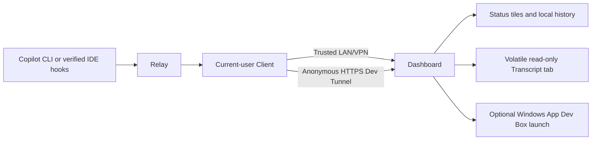

<div align="center">

# Agent Signaler

**A Windows dashboard for seeing what Copilot CLI and verified IDE agents are doing across your development machines.**

[Use cases](#use-cases) · [How it works](#how-it-works) · [Get started](#get-started) · [Security](SECURITY.md) · [Contributing](CONTRIBUTING.md)

</div>


> [!IMPORTANT]
> Agent Signaler is an early Windows-only project. Automated coverage is extensive,
> but live cloud, installer lifecycle, IDE compatibility, and release-signing
> acceptance are still incomplete. Review the [acceptance record](docs/ACCEPTANCE.md)
> before relying on it for important workflows.

## Why Agent Signaler?

- **See agent state at a glance:** executing, waiting for input, succeeded, failed,
  idle, or offline.
- **Monitor multiple machines:** identify each computer by name, optional display
  name, note, source, and latest activity.
- **Keep status visible:** switch to compact always-on-top tiles while working in
  another application. Compact tiles show only the state glyph, using the same
  colors and symbols as the full dashboard; hover for machine details.
- **Open the mapped Dev Box:** refresh a validated Windows App connection or focus
  an existing matching window. Launches from compact view show a cancellable progress
  dialog while searching local windows, refreshing the connection, and launching Windows App.
- **Choose the network boundary:** use a trusted private LAN/VPN or an explicitly
  configured anonymous Dev Tunnel backed by a loopback-only listener.
- **Configure integrations deliberately:** preview and apply supported user-level
  CLI and IDE hooks with ownership and rollback checks.

## Use cases

| Use case | Workflow and result |
| --- | --- |
| **Monitor long-running Copilot CLI work** | Run the managed Client on a development machine. Status tiles show execution, waiting, result, idle, and offline transitions. Separately enabled prototype details show bounded, partial conversation activity. |
| **Track several development machines** | Connect multiple Windows environments and give them clear display names or notes. Each tile keeps machine identity and activity separate. |
| **Keep status visible while multitasking** | Minimize the dashboard into compact always-on-top tiles. Status remains visible without keeping the full window open. |
| **Open the correct Dev Box** | Explicitly map a machine to an Azure Dev Box. Agent Signaler refreshes the validated connection or restores and focuses a matching Windows App window. |
| **Share status across networks** | Use an anonymous Dev Tunnel to expose only the loopback dashboard endpoint instead of opening the LAN listener directly to the Internet. |
| **Integrate supported IDE agents** | Configurator discovers candidate integrations, previews exact changes, verifies supported hook behavior, and applies owned user-level configuration transactionally. |

## Product tour

| Dashboard | Compact monitoring |
| --- | --- |
|  |  |

| Dev Box workflow | Sharing and diagnostics |
| --- | --- |
|  |  |

All previews use fictional machines, accounts, URLs, and resources.

## How it works



Relay accepts bounded hook events through current-user IPC. The persistent Client
is the sole managed network reporter. Status/presence and SQLite machine history
remain content-free. A separately versioned prototype transcript stream uses only
the configured HTTPS Dev Tunnel and bounded memory, not SQLite.

Computer details opens on **Settings**, preserving existing editing and Dev Box
actions; **Transcript** is a read-only, partial view, not a conversation archive.
No production assistant-file format is currently independently verified for
Copilot CLI, VS Code, or Visual Studio. Supported hook prompts/activity can still
appear; assistant readers remain unavailable until independent evidence exists.
See the [published capability evidence](docs/transcript-capability-evidence.md);
the production file-adapter registry is deliberately empty.

## Get started

### Requirements

- Windows 11 x64
- .NET SDK `10.0.100` or a compatible feature-band selected by `global.json`
- Visual Studio Windows/WinUI tools for application development
- Visual Studio x64 C++ tools for the native installer bootstrapper
- Optional: Microsoft Dev Tunnels CLI for Internet sharing
- Optional: Azure CLI and Windows App for Dev Box connections

### Build and test

```powershell
dotnet restore AgentSignaler.slnx -p:Platform=x64
dotnet build AgentSignaler.slnx --no-restore --configuration Release -p:Platform=x64
dotnet test tests\AgentSignaler.Service.Tests\AgentSignaler.Service.Tests.csproj -p:Platform=x64
dotnet test tests\AgentSignaler.Remote.Tests\AgentSignaler.Remote.Tests.csproj -p:Platform=x64
dotnet test tests\AgentSignaler.Integration.Tests\AgentSignaler.Integration.Tests.csproj -p:Platform=x64
dotnet test tests\AgentSignaler.Tunneling.Tests\AgentSignaler.Tunneling.Tests.csproj -p:Platform=x64
```

The live tunnel test is opt-in and skipped unless
`AGENT_SIGNALER_LIVE_TUNNEL_TEST=1`. Do not enable it without an approved disposable
environment and explicit anonymous-exposure authorization.

Build and inspect installers locally without installing or publishing them:

```powershell
.\scripts\Build-Installers.ps1 -Version 1.0.14
```

See the [user guide](docs/user-guide.md) for setup and operation,
[installer guide](installers/README.md) for packaging details, and
[contribution guide](CONTRIBUTING.md) for development safety requirements.

## Security and privacy

This prototype requires **external informed consent before distribution/use** for
the content, destination, and retention policy. Agent Signaler neither collects nor
verifies consent; installation and informational notices are not evidence of it.

New configuration **v5** and explicit migrations default **Share detailed
conversations** on, with an explicit opt-out. Versions 1–4 and ordinary HTTP/LAN
remain status-only. Upgrade Dashboard first, then Relay/Client/Configurator
together before migration. Repair/recovery must preserve a saved opt-out;
downgrade requires an explicit status-only transaction, not a version-number edit.

Allowed details are hook-sourced user messages, tool names/observed status, and
completed user-facing assistant replies only from verified stop-triggered Client
readers. Allowed message text can contain PII and is not automatically redacted.
Tool arguments/results, raw errors, reasoning, attachments, and arbitrary payloads
are excluded. Local stop references never enter HTTP, persistent state, logs, or
viewer models. Relay never reads files, sends HTTP, or starts Client; tray Exit
stops managed reporting.

Conversation storage is bounded application memory: 32 KiB events, a 4 MiB Client
budget, a 64 MiB receiver budget, and 30-minute receiver retention. No spool,
export, or replay archive is created. Host transcript files, OS paging,
hibernation, and external crash capture mean this is **not** a promise that
conversation data never exists on disk.

Details require the Dashboard's owned, running Dev Tunnel and loopback Internet
listener, with normal HTTPS certificate validation. Anonymous senders are **not
authenticated**: reachable callers can spoof identities, inject reports, request
purges, and consume capacity. There is no pairing, bearer-token enrollment, or
network-facing transcript reader. See the [user guide](docs/user-guide.md) for
opt-out, receiver disable/clear, bounded reader/viewer controls, and limitations.

Read [SECURITY.md](SECURITY.md) before deployment. Report vulnerabilities
privately rather than opening a public issue.

## Project status

- Source builds and automated non-live tests are the current supported
  development path.
- Installer, upgrade, rollback, Windows App, Azure, Dev Tunnel, and IDE workflows
  still have documented manual release gates.
- GitHub Releases may contain explicitly labeled unsigned development MSIs with
  published SHA-256 checksums. No signed release is currently promised.
- Source code is available under the [MIT License](LICENSE).

Detailed status is tracked in [docs/ACCEPTANCE.md](docs/ACCEPTANCE.md) and
[docs/MANUAL-TEST-PLAN.md](docs/MANUAL-TEST-PLAN.md).

## Community

- [Contributing](CONTRIBUTING.md)
- [Support](SUPPORT.md)
- [Security policy](SECURITY.md)
- [Code of Conduct](CODE_OF_CONDUCT.md)

Licensed under the [MIT License](LICENSE).
